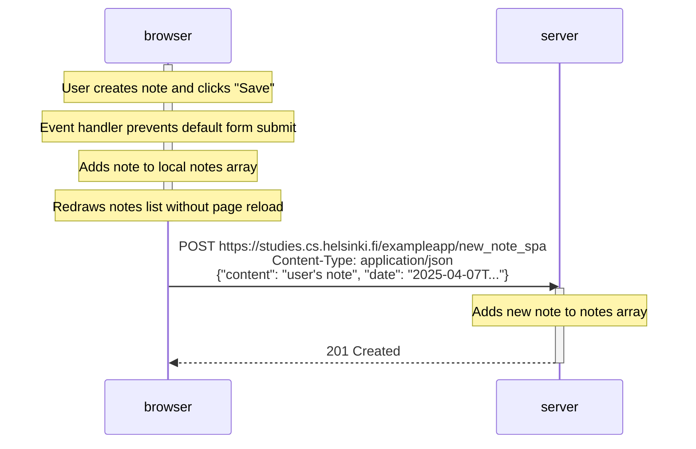

```mermaid

sequenceDiagram
    participant browser
    participant server
    
    activate browser
    Note over browser: User creates note and clicks "Save"
    Note over browser: Event handler prevents default form submit
    Note over browser: Adds note to local notes array
    Note over browser: Redraws notes list without page reload
    deactivate browser
    
    browser->>server: POST https://studies.cs.helsinki.fi/exampleapp/new_note_spa<br/>Content-Type: application/json<br/>{"content": "user's note", "date": "2025-04-07T..."}
    activate server
    Note over server: Adds new note to notes array
    server-->>browser: 201 Created
    deactivate server
    
```
